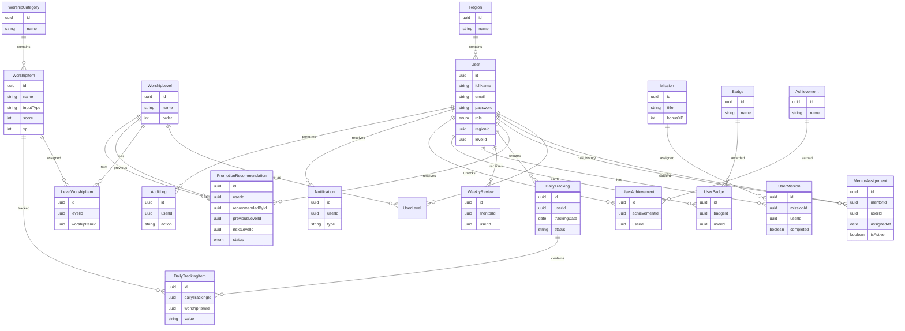

# Entity Relationship Diagram (ERD)

Version: 1.0

---

# Overview

This document describes the relationships between the main entities in THABAT.

The diagram represents the conceptual database design.

---

---

# Notes

## Mentor Assignment

A Mentor is also a User.

The MentorAssignment table links:

Mentor User

↓

Student User

This allows:

- Mentor transfers
- Assignment history
- Multiple historical mentors

---

## Daily Tracking

Each user has one DailyTracking per day.

Each DailyTracking contains many DailyTrackingItems.

---

## Worship System

Levels do not own worship items directly.

The LevelWorshipItem table allows:

Many Levels

↓

Many Worship Items

---

## Missions

A Mission may be assigned to many users.

Each user has independent progress.

---

## Badges

Badges are templates.

UserBadge stores earned badges.

---

## Achievements

Achievements are templates.

UserAchievement stores unlocked achievements.

---

# Database Design Principles

- UUID Primary Keys
- Soft Delete
- Immutable History
- Normalized Structure
- Foreign Key Constraints
- No Cascading Delete for Historical Data

---

END OF DOCUMENT
